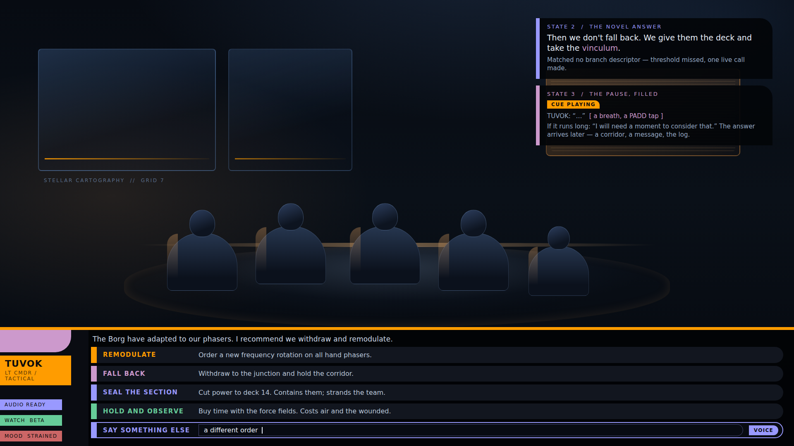

# The ship's computer — the enumerated set as an API, and the refusal (M6, first half)

`docs/staff-meetings.md` (the owner's design: *"The ship's computer is the same machinery"*), the guardrail
paragraph beneath it, `docs/handoff-live-crew-and-meetings.md` (M6), `docs/hook-register.md` and
`scripts/hooks-check.sh` (the derived-surface pattern this copies), `docs/evidence/meeting-overlay.md` (M3),
`docs/evidence/model-call.md` (M4) and `docs/evidence/voice-and-casting.md` (M5, the fixtures reused here),
applied on `feat/the-computer` (cut from `testing`), 2026-10-09.

**Observed, and the command that produced it.** Everything below is the output of a command named beside
it, on this tree, after `cmake -S ../upstream/efgame -B ../upstream/efgame/build-linux
-DLWH_MODULE_DIR=$PWD/module && cmake --build ../upstream/efgame/build-linux --target efgame --target efui`
(both modules built, only the pre-existing `-Wwrite-strings` warnings). The engine runs are headless
(`xvfb-run`, `SDL_AUDIODRIVER=dummy`) on `sasquatch`; the frames are rendered, not inferred. No model,
cache, audio or generated content is committed.

## What was built, and where

| file | what it is |
|---|---|
| `module/ship/console_api.def` | **new**: the ship's API — one row per console verb: the verb, its arguments, the station that owns it. Included as an X-macro and parsed by the check. |
| `module/ship/ship_core.{h,cpp}` | the API's accessors (`ConsoleVerbCount`, `ConsoleVerbAt`, `FindConsoleVerb`); the computer (`ComputerVoice`, `ComputerRefusal`, `ComputerPill*`, `BuildComputerBrief`, `AddressComputer`); a `MEET_COMPUTER` kind and its authored skeleton; `SPEAK_COMPUTER` and the line-voice helper that gives it its own reference. |
| `module/ship/g_ship.cpp` | the host half: `ship computer open\|close\|choose\|say`, the routing of the overlay's own `ship meeting choose\|say` to the computer, the `MEET_COMPUTER` rail name, and the `g_shipTest 85` demonstration. |
| `module/ui/ui_lwh_meeting.cpp` | **the same overlay, edited not replaced**: the room now draws the host's recorded answer (`lwh_ship_meeting_said`), so the computer's refusal appears in the speaker rail exactly where a meeting's seam answer does. There is no second UI. |
| `tools/console/verbs.py` | **new**: the derivation (`Svcmd_Ship_f`'s verb literals) and the bidirectional check. |
| `scripts/api-check.sh` | **new**: the freshness check, wired into `scripts/test.sh`. |
| `scripts/computer-check.sh` | **new**: one headless run of the whole computer path. |
| `tests/ship/test_ship_core.cpp` | `TestConsoleApi` and `TestTheComputer`. |
| `tests/tools/test_console_verbs.py` | **new**: the parser and both failure directions, with no engine. |

## Task A — the ship's API is enumerable, and checked

**The choice: a checked curated list.** `module/ship/console_api.def` is authored (a person names each
verb, its arguments and its station), and `scripts/api-check.sh` re-derives the surface from the console
and fails on any disagreement. A pure derivation could not carry *arguments* or *station ownership* — those
are not in the console as data, they are scattered through `Q_stricmp` chains and a `why = ...` ladder — so
the honest shape is the `hooks-check.sh` shape: a curated register guarded by a derived surface. The
enumerated set is the console's own verbs, so a verb cannot exist in the console and be refused by the
computer for lack of a row.

**Passing on the tree, and failing in both directions.**

```
$ scripts/api-check.sh
verbs.py: module/ship/g_ship.cpp answers 128 verb(s); module/ship/console_api.def enumerates 128
PASS  every console verb is in the ship's API, and every API verb is answered by the console
```

Direction one — a verb added to the console and not enumerated (a temporary copy of both files, which is
what the check itself can be pointed at):

```
$ python3 tools/console/verbs.py check --console <g_ship.cpp + 'frobnicate'> --register <unchanged>
verbs.py: ... answers 129 verb(s); ... enumerates 128
FAIL  the console answers and the API does not carry (1): frobnicate
exit=1
```

Direction two — a row the console does not answer:

```
$ python3 tools/console/verbs.py check --console <...> --register <api.def + 'warpnine'>
FAIL  the console answers and the API does not carry (1): frobnicate
FAIL  the API carries and the console does not answer (1): warpnine
exit=1
```

And the check caught this pass's own new verb in the real tree: adding `ship computer` to `Svcmd_Ship_f`
made `scripts/api-check.sh` fail with `FAIL ... (1): computer` until the row was added to
`console_api.def`. That is the guardrail doing its job on the work that added it.

The unit tests hold the other half without an engine (`python3 -m unittest discover -s tests/tools`): the
derivation, the row parser, the pass, and both failure directions. `scripts/test.sh` runs `api-check.sh`
between the hook-register and the harness checks, so console/API drift is a CI failure.

## Task B — the computer, on the meeting's own overlay

The computer is a `MEET_COMPUTER` brief: the same `MeetingBrief`, the same `AuthoredSkeleton`, the same
`ui_lwh_meeting.cpp` room. The room the meeting uses is the room the computer uses; **no second UI was
built** — the proof is that `module/ui/` has one meeting file, and the computer is drawn by it. Pills are
the API's verbs, the free-text pill is there, and the rail is `THE COMPUTER`:

```
$ scripts/computer-check.sh
    computer test: the ship's API enumerates 128 verb(s); the computer's voice is computer
    computer test: the room is the meeting's own; kind computer, options 6
    computer test: pill 1: Ship's status -> status
    ... pill 6: Open the month report -> report
    computer test: the computer is not crew: 14 pool voices, and it is none of them
```

 — the rendered frame is
`build/g3-home/baseEF/screenshots/lwh_computer.tga` (not committed). The rail reads `THE COMPUTER`; the
pills are the six API verbs with their costs; the free-text pill carries `VOICE`; the footer is the
meeting room's own keys. The screen is the one M3 built.

**The voice is its own.** `ComputerVoice()` returns `computer`, and `MeetingLineKey`/`PlanMeetingAudio`
resolve a `SPEAK_COMPUTER` line to it directly rather than through `CastVoice`'s pool draw. The lines are
planned during generation, keyed under that reference:

```
    computer test: pre-generated during generation: 6 line(s), voice computer, key 654dd3802aa23ef2, inference calls=0
```

## Task C — the refusal, in character, and the state across it

An input whose first token is not in the enumerated set is refused with the canonical line, and nothing is
invented. The command below is close to real and answered by no console verb:

```
    computer: "warpnine" -> REFUSED: that function is not available
    computer test: free text "warpnine" (not in the API) -> that function is not available
    computer test: the ship's state is byte-identical across the refusal: yes
```

**Byte-identical** is `ship::Pack(vessel)` taken immediately before and after `AddressComputer` — the same
function the console and the overlay call — so what is proved is that the refusal writes nothing, not that
a tick happened not to change something. The unit test holds the same invariant (`Pack(s)` before and
after, `TestTheComputer`).

**The log carries what was said**, and the refusal is on the screen the meeting uses (the rail's lower
strip, `lwh_ship_meeting_said`):

```
    computer test: the overlay's refusal reached the log: that function is not available
    computer test: log [command] the computer: the computer refused: warpnine -- that function is not available
```

The refusal is drawn (`build/g3-home/baseEF/screenshots/lwh_computer_refused.tga`, not committed): the
rail reads `WARPNINE -> THAT FUNCTION IS NOT AVAILABLE` under `THE COMPUTER`.

## Task D — no inference on arrival, and the call counts

The engine performs no I/O to a model, as M4 established: it writes manifests and reads files; the
computer's answer is an authored line from the API. The demonstration counts the addresses and prints the
inference count:

```
    computer test: pre-generated during generation: 6 line(s), voice computer, key 654dd3802aa23ef2, inference calls=0
    computer: "status" -> recognised: Acknowledged. status.
    computer test: addressed 4 time(s), inference calls=0; nothing invented: yes
```

A pill is offered for its line's measured duration exactly as a meeting's is (`MeetingLineSeconds`); with
the model absent the text fallback paces it, never a call. The same command a second time is the identical
authored line and still zero calls:

```
    computer test: pill 1 (status) -> Acknowledged. status.
    computer test: the same command again -> Acknowledged. status. (the authored line; inference calls=0)
```

## The register, and the counts

`docs/hook-register.md`: eleven hooks are added — the API readers (`ConsoleVerbCount`, `ConsoleVerbAt`,
`FindConsoleVerb`), the computer's voice and refusal (`ComputerVoice`, `ComputerRefusal`), its pills
(`ComputerPillCount`, `ComputerPillVerb`, `ComputerPillLabel`, `ComputerPillCost`), and the machinery
(`BuildComputerBrief`, `AddressComputer`). All are reached in play: the overlay's keys send
`ship meeting say|choose`, and the host routes them to the computer. The counts are re-derived from the
register's own rows, counted: **74 + 63 + 54 + 183 + 18 = 392**, and **227 + 130 + 35 = 392**.
`scripts/hooks-check.sh` passes.

## The commands, and what they returned

```
scripts/api-check.sh          -> PASS (the console's verbs and the API agree, both directions)
scripts/computer-check.sh     -> PASS (the computer on the meeting overlay: pills, free text, its own
                                 voice, the refusal with the state byte-identical, the log, and a replay
                                 that costs nothing)
scripts/test.sh               -> all checks passed
scripts/check.sh              -> the entity dictionary and the script corpus as before
tests/ship/test_ship_core     -> ship_core: all checks passed (including TestConsoleApi, TestTheComputer)
tests/tools (unittest)        -> OK (including test_console_verbs)
scripts/meeting-overlay-check.sh -> PASS
scripts/model-call-check.sh   -> PASS
scripts/audio-check.sh        -> PASS
```

## What could not be verified

- **Whether being addressed by the computer feels like talking to a ship rather than a menu.** That is the
  owner's, and it needs the picture (above). This lane can show the screen, the voice reference and the
  counts; it cannot judge the read.
- **Whether the computer's voice is the right one.** The clip is the retail bank's `computer` (375 lines,
  the largest in the install); whether a rendered line sounds like the ship is the owner's ear, and the
  clip is player-local, never committed.
- **Whether six is the right number of pills.** The pill row is a curated subset of the API; a scrolling
  choice of 128 is a different screen, and this lane did not build one.

## Judgement calls, named as calls

1. **A checked curated list, not a derivation.** Arguments and station ownership are not in the console as
   data. The `.def` is curated; the verb set is derived and checked both ways. Named above.
2. **The set is the console's whole verb surface**, by the brief's own demand that the enumeration and the
   console not drift. The computer therefore "may answer" every console verb, including developer ones;
   which of them are *sensible* to address is a later curation, and it can only be made against a set that
   is knowable.
3. **The pills are a small authored subset; free text is the whole set.** The overlay draws six options.
   The pills are the six the room offers; `FindConsoleVerb` is the membership test for everything else, so
   a pill and a typed word take the identical path.
4. **A recognised command is answered, not executed.** The answer is an authored line and the outcome is
   `EFFECT_RECORD` (minuted): the simulation decides, and here it decides to change nothing. Executing an
   arbitrary console verb from the model path would be the model writing state by proxy; this lane does
   not. Named so it can be extended deliberately.
5. **"A replay costs nothing" is from the API, not the log.** The enumerated set makes the answer
   deterministic and authored, so there is no live call to replay and nothing to promote; the log carries
   what was said for the record. The meeting's M4 replay-from-the-log is unchanged.
6. **`module/ui/ui_lwh_meeting.cpp` was edited** (one block) to draw the host's `lwh_ship_meeting_said`
   rather than only the screen's own typed buffer, so the computer's refusal is visible where the
   meeting's seam answer already was. It is the same file, the same room, no second UI.
7. **`MEET_COMPUTER` is a meeting kind so the machinery is shared**, but it is never queued: `MeetingDue`
   has no case for it, so `EmitDueMeetings` never emits it and the save format is unchanged. The computer
   is addressed, not convened.

## What voice in will need (the next lane, named and not built)

M6's second half is speech-to-text feeding the same pill. Because the pill emits text, nothing else
changes: STT produces a string that takes the identical `ClassifyNovelInput` path (for a meeting) or the
identical `FindConsoleVerb` membership test (for the computer). Its premise, for the next pass: the model
the spike borrowed (`sherpa-onnx-whisper-tiny.en`) is still on this host under
`/home/c/hermes-vox/models-store/work/tw/`, and it needs a throwaway venv built by the procedure
`docs/evidence/voice-spike.md` records. None of it is built here.
